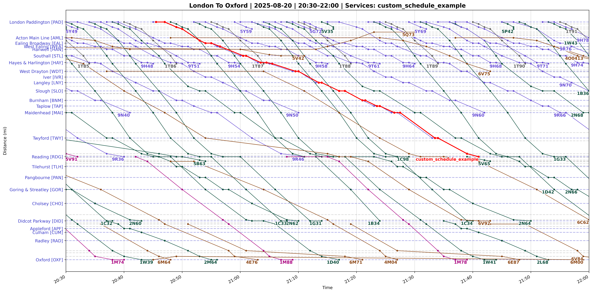

# py‑train‑graph

Plot distance‑time graphs for UK train services using live data from
[RealTimeTrains](https://www.realtimetrains.co.uk/) plus your own
CSV schedules.



---

## Features

* **Fetches from RTT** – specify stations and a time window and it pulls everything automatically
* **Interactive view and image export** – zoom and pan in the graph window, or use exported PNG files
* **Custom schedules** – overlay your own timings from a CSV file
* **One-click launcher or CLI** – select a preset file in a GUI or configure arguments in the CLI
* **Configurable** – reverse routes, filter by direction, limit number plotted, ...
* **Presets system** – save common configurations as reusable JSON files
* **Disk caching** – uses previously downloaded data where available
* **Inputs include**: date, time window, route CSV, location codes, and (optionally) custom timings

---

## Installation

[Download a zip](https://github.com/jprince8/py-train-graph/archive/refs/heads/main.zip), and extract it.

Or clone the repo:

```bash
git clone https://github.com/your‑github/py‑train‑graph.git
```

---

## Quick start

On **Linux/macOS**, double-click `launch-train-graph.sh`, or launch via:

```bash
./launch-train-graph.sh
```

On **Windows**, double‑click `launch-train-graph.bat`, or launch via:

```bat
.\launch-train-graph.bat
```

* Allows selection of a json preset file from the `presets` directory (additional preset files can be set up to create new graphs)
* Saves `graph_<headcodes>_<timestamp>_overview.png` (20 × 10 in, 400 dpi)
* Saves `graph_<headcodes>_<timestamp>_zoomable.png` (40 × 30 in, 100 dpi)
* Opens the interactive plot window (`--no-show` to suppress)

---

## CLI

Alternatively, run using CLI arguments:

```bash
./launch-train-graph.sh routes/london_to_oxford.csv 2025-08-20 03:00 06:00 \
  -l PAD ACTONW HTRWAJN STL \
  -m 1 --direction up
```

```bat
.\launch-train-graph.bat routes/london_to_oxford.csv 2025-08-20 03:00 06:00 `
  -l PAD ACTONW HTRWAJN STL `
  -m 1 --direction up
```

Or use a preset:

```bash
./launch-train-graph.sh -p example_preset.json
```

```bat
.\launch-train-graph.bat -p example_preset.json
```

## CLI reference

```
py-train-graph [ -p PRESET | ROUTE_CSV DATE START END ] [options]

positional arguments:
  ROUTE_CSV             CSV mapping Location→Distance (mi)
  DATE                  YYYY-MM-DD
  START                 window start (HH:MM)
  END                   window end   (HH:MM)

optional arguments:
  -p, --preset           name or path of a JSON preset (e.g. example_preset.json)
  -l, --locations        list of GB‑NR location codes (required) (e.g. PAD, ACTONW)
  -m, --margin-hours     extend window before (hours, default 0)
  -s, --custom_schedule  custom CSV schedule (may repeat, e.g. custom_schedule_example.csv)
  -d, --direction        up | down
  -n, --limit            max RTT services plotted
  --reverse-route        plot distances negative
  --no-show              save images only, no GUI
  -a, --always-include   headcodes to force-include (bypass filters)
  -v, --verbose          increase logging verbosity (-v, -vv)
```

---

## Custom schedules

Create a CSV with at least these columns:

| Location          | Arr       | Dep       |
|-------------------|-----------|-----------|
| London Paddington | 12:15:00  | 12:17:00  |
| Acton West        | 12:25:30  | 12:26:00  |
| ...               | …         | …         |

Times **must** be `HH:MM:SS`.  Use the `-s` flag to include one or more files.
Set `same_custom_colour` to `true` in a preset to draw every custom schedule
in the same colour.

---

## Route CSV format

The **route CSV** defines station names and their distances (in miles) along the route. It must contain at least these two columns (header row required):

| Location                  | Distance (mi) |
|---------------------------|---------------|
| London Paddington         | 0.000         |
| Acton West                | 5.432         |
| …                         | …             |

- **Location**: exact station label as used by RealTimeTrains (\[station code\] automatically removed).
- **Distance (mi)**: decimal miles from the reference point (e.g. zero at Paddington).

---

## Preset JSON format

Save common parameters in a **JSON** file under `presets/`. Example structure:

```json
{
  "route_csv": "routes/london_to_oxford.csv",
  "date": "2025-08-20",
  "start_time": "20:30",
  "end_time": "22:00",
  "locations": ["PAD","ACTONW","HTRWAJN","STL","REDGWJN"],
  "margin_hours": 1,
  "direction": "down",
  "always_include": [],
  "custom_schedules": ["custom_schedule_example.csv"],
  "limit": null,
  "reverse_route": null,
  "show_plot": null,
  "same_custom_colour": null
}

```

---

## Licence

MIT © Jonathan Prince, 2025


